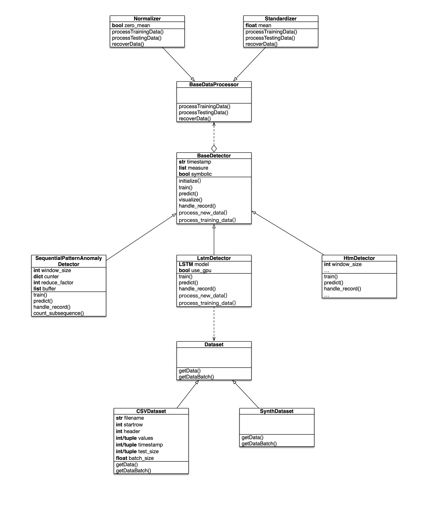

# Library Introduction

## Library Structure

data: store benchmark data for testing

src: store the source code

UCDT structure:

The source code is organized into 4 layers

utils <- common <- detectors <- test

layers at higher level have access to the functions defined in lower layers

utils: define basic utils functions that can be used by developers and users

common: define common logic that can be shared by multiple detectors, can only be used by developers

detectors: define core logic for anomaly detection

test: define test logic to test functions in other layers

## Developer Guide

In the detectors package, there is a BaseDetector class defined in base.py. The library users will access our algorithms
via this interface. All other Detector class need to inherit this base class. The following are the introduction
to each interface in the BaseDetector:

    def __init__(self, timestamp_col_name=None, measure_col_names=None, symbolic=False):
  
### If you want to know the design principle behind this, read:
This is the constructor of the Detector, after compare different datasets, the data team
summarized all possible formats which can be reflected in this constructor

1. All data record must contains at least one field for anomaly detection
2. Timestamp field is an optional field for some dataSet, but some algorithms may have a dependency on the timestamp
3. Some data record are treated as numerical value, some are treated as symbolic. 

Our algorithm will finally take streaming input with the following format:

([optional]timestamp, attr_value1, attr_value2, ...., ) for numeric-based algorithm

([optional]timestamp, "attr_value1,attr_value2,...") for symbolic-based algorithm, the related attribute value will be linked together to form a single combined symbolic

The user may give us a list or a dictionary.

If the user provides a list, then we assume that is in correct format already and will feed that into the algorithm directly

The user may give us a dictionary {"time":123,"attr1":20, "attr2": 20}
then we need to pre process it to [123, 20, 20] and then feed into the algorithm. The pre process function
need to know which key is for timestamp and the order of the attribute, therefore in contributor takes in 
timestamp_col_name and measure_col_names

If the contributor see a None for timestamp_col_name, it is assumed that there is no timestamp

If the contributor see a None for measure_col_names, it is assumed that user will provide a list in stead of dictionary

If the constructor see a True for symbolic, it will link all value column to form a single string symbolic

### If you just want to know how you need to work with this:

#### Write your constructor to define an input data format

For detector writer, you need to define your own constructor based on the characteristics of your own algorithm.

For example, if your algorithm takes in [timestamp, value1, value2]
you can just define your constructor as

     def __init__(self, timestamp_col_name="time", measure_col_names=None):
            super(SequentialPatternAnomalyDetector, self).__init__(timestamp_col_name=timestamp_col_name,
                                                                   measure_col_names=measure_col_names, symbolic=False)
                                                                   
And the pre process module will be able to give you the data in this format: [timestamp, value1, value2]

If timestamp column exist, it will always be placed at the first position.

#### Override initialize method for algorithm specified initialization

initialize all the resource that your algorithm may need to use in 
    
      def initialize(self, *args, **kwargs):
            """
            Detector specific initialization, initialize resource that is
            unique for a specific detector
            """
            pass
            
By calling this method, one do not need to re-create a detector object and can initialize everything.

#### Override handle_record method for handling streaming data

    def handle_record(self, record):
        """
        This is the main anomaly detection method, it deals with streaming data
        instead of a block data.
        """
        raise NotImplementedError
        
The first thing you need to do is to pre_process the record using: record = self._pre_process_record(record)

This function will return you a list like  [timestamp, value1, value2] according what you did in __init__()

Pay attention that, during record handling, the algorithm should learn the pattern automatically. You need to define another 
method or set your own ignore condition in this method if you decide not to learn while handling record. Don't add new parameter to this method

#### Optional: Override train method if your algorithm need a training process

     def train(self, training_data):
        """
        This is a optional training process for the anomaly detection
        It should be call before handle_record to improve performance
        """
        pass

unlike handle_record method, the training_data will be a collection of record, you can do optimization with that.

### Other method that may be useful:

A function for checking the accepted data format

     def get_data_format(self):
        """
        Return the data record format that is accepted by this detector
        """
        return {
            "timestamp": self.timestamp,
            "measure": self.measure,
            "symbolic": self.symbolic
        }

A function for testing through a list of record:

        def handle_record_sequence(self, record_sequence):
            """
            This function provide an ability to handle a list of data record sequentially
            """
            result = []
            for record in record_sequence:
                result.append(self.handle_record(record))
            return result
            
### Test your detector:
Put your raw data to data folder, write your test cases in src/test     

### Looking for example?

If you still have some questions, you can either ask the @Data team or go through an example: SequentialPatternAnomalyDetector written in sequential_pattern.py
We need to make sure every detectors are written according to this standard. 
 
### Coding quality matter!

We need to ensure the code quality in library folder because that is what we are going to publish.
If you want to write some temporal code, put it into other folders. 

Please follow the 4 layer structure when coding:

utils <- common <- detectors <- test

think about what code can be shared with other developers and what can be shared with your user.

Create a new branch when developing your detector, merge it to master after review.
         
### Asking for feedback

If you think the framework is not compatible with your algorithm. Notify @Data Team as soon as possible. We will modify it to satisfy your requirement.

